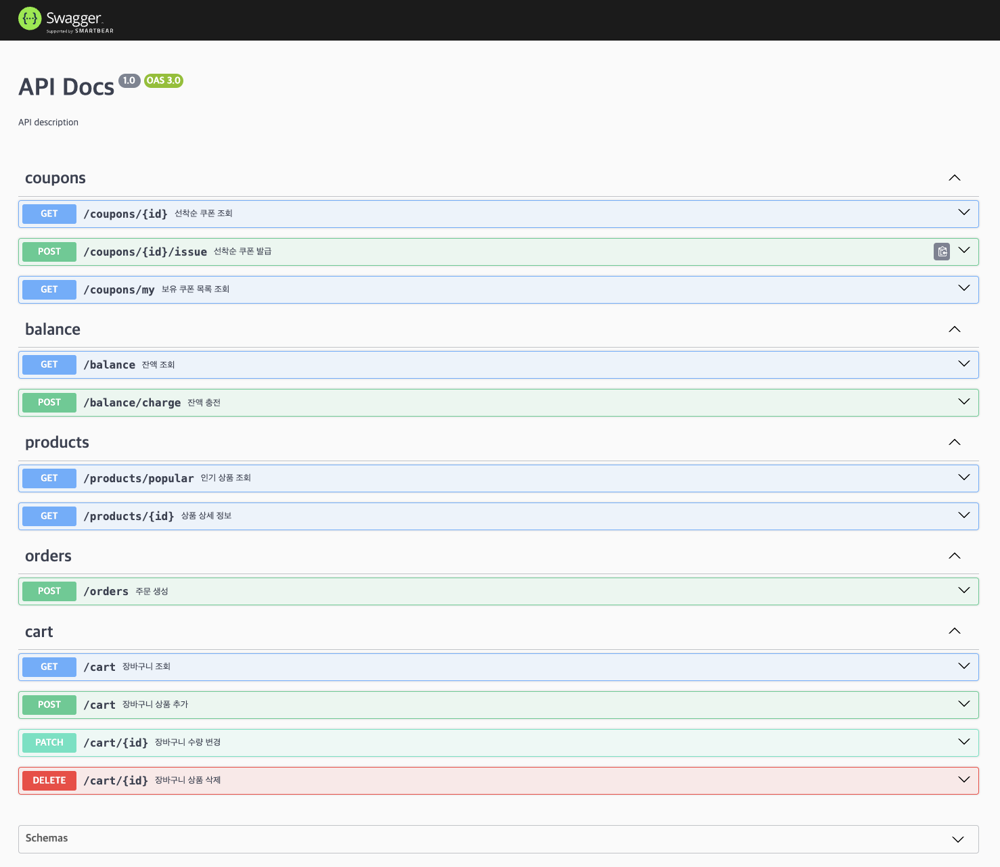

# 이커머스 서비스 개발

## 프로젝트 개발 계획(Milestone)

- URL: https://github.com/users/efforthye/projects/4/views/4?groupedBy%5BcolumnId%5D=158073164&sortedBy%5Bdirection%5D=desc&sortedBy%5BcolumnId%5D=Labels
<br/><br/>

## 프로젝트 기능
#### 1. 선착순 쿠폰 조회
- 설명: 인증된 유저가 특정 선착순 쿠폰의 상태와 본인의 발급 여부를 확인한다.
- 주요 흐름:
 - 유저가 쿠폰 조회 요청을 보낸다.
 - 서버는 쿠폰의 남은 수량, 총 수량, 유저의 발급 이력을 확인하고 응답한다.

#### 2. 선착순 쿠폰 발급
- 설명: 인증된 유저가 선착순 쿠폰을 요청하여 발급받는다.
- 주요 흐름:
 - 서버는 쿠폰 잔여 수량을 확인하고, 발급 가능 여부를 판단한다.
 - 발급 가능한 경우 쿠폰 수량을 감소시키고 유저 이력에 추가한다.

#### 3. 유저 쿠폰 목록 조회 
- 설명: 인증된 유저가 보유한 모든 쿠폰의 목록과 각 쿠폰의 상세 정보를 확인한다.
- 주요 흐름:
 - 서버는 유저의 보유 쿠폰 목록과 각 쿠폰의 상세 정보를 조회하여 반환한다.

#### 4. 유저 잔액 조회
- 설명: 인증된 유저가 자신의 현재 잔액을 확인한다.
- 주요 흐름:
 - 서버는 유저의 잔액 데이터를 조회하여 반환한다.
- 기대 동작: 유저는 자신의 현재 잔액 정보를 정확히 확인한다.

#### 5. 유저 잔액 충전
- 설명: 인증된 유저가 자신의 잔액을 요청 금액만큼 충전한다.
- 주요 흐름:
 - 서버는 충전 요청을 처리하고, 잔액 데이터를 업데이트한다.

#### 6. 인기 상품 조회
- 설명: 최근 특정 기간 동안 가장 많이 판매된 상품을 조회한다.
- 주요 흐름:
 - 캐시에 저장된 인기 상품 데이터를 확인하거나, 데이터베이스에서 최신 데이터를 집계한다.
- 기대 동작: 인기 상품 목록을 빠르고 정확하게 제공하며, 캐시를 활용해 성능을 최적화한다.

#### 7. 상품 상세 조회
- 설명: 특정 상품의 상세 정보를 유저에게 제공한다.
- 주요 흐름:
 - 서버는 상품의 기본 정보, 이미지, 옵션, 설명 등을 조회하여 반환한다.

#### 8. 장바구니 상품 추가
- 설명: 인증된 유저가 특정 상품을 장바구니에 추가한다.
- 주요 흐름:
 - 서버는 요청한 상품과 옵션의 재고를 확
<br/><br/>

# 이커머스 시스템 설계
## 목차
1. [ERD Diagram](#erd-diagram)
    - [테이블 설계 상세 정의내역](#테이블-설계-상세-정의내역)
2. [플로우 차트 (Flow Chart)](#플로우-차트-flow-chart)
    - [플로우 차트 설명](#플로우-차트-설명)
3. [시퀀스 다이어그램](#시퀀스-다이어그램)
    - [쿠폰 관련](#쿠폰-관련)
    - [잔액 관련](#잔액-관련) 
    - [통계 관련](#통계-관련)
    - [장바구니 관련](#장바구니-관련)
    - [상품 관련](#상품-관련)
4. [Mock API 생성](#mock-api-생성)
5. [프로젝트 구조 및 실행 방법](#프로젝트-구조-및-실행-방법)
    - [프로젝트 구조](#프로젝트-구조)
    - [기술 스택](#기술-스택)
    - [프로젝트 실행 방법](#프로젝트-실행-방법)
<br/><br/>


## ERD Diagram

- Edit URL: https://dbdiagram.io/d/6776be0e5406798ef7207566


### 테이블 설계 상세 정의내역

<details>
<summary>테이블 설계 상세 정의 내역 보기</summary>

```sql
/* 
* 선착순 쿠폰 관련 테이블
*/
// 쿠폰 테이블: 쿠폰 기본 정보
Table coupon {
 id integer [primary key] // 쿠폰 아이디
 name varchar // 쿠폰명
 type varchar [note: '금액/비율 유형'] // 할인 유형  
 amount decimal [note: '금액/비율 값'] // 할인 금액(정액) 또는 비율(정률)
 min_order_amount decimal [note: '최소 주문 금액'] // 최소 주문 금액
 valid_days integer [note: '발급일로부터 유효기간(일)'] // 유효 기간
 created_at timestamp // 쿠폰 생성 시간
}
// 선착순 쿠폰 테이블: 선착순 발급 쿠폰 관리  
Table fcfs_coupon {
 id integer [primary key] // 선착순 쿠폰 아이디
 coupon_id integer // 쿠폰 아이디 fk
 total_quantity integer // 총 발행량
 stock_quantity integer // 잔여 발행량  
 start_date timestamp // 발급 시작 일시
 end_date timestamp // 발급 종료 일시  
 created_at timestamp // 등록 일시
}
// 유저별 보유 쿠폰 테이블
Table user_coupon {
 id integer [primary key] // 유저 쿠폰 아이디
 user_id integer // 유저 아이디 fk
 coupon_id integer // 쿠폰 아이디 fk  
 status coupon_status // 사용가능 여부
 expiry_date timestamp // 만료 일시
 created_at timestamp // 발급 일시
 used_at timestamp // 사용 일시
}
// 유저 쿠폰 이력 테이블
Table user_coupon_history {
 id integer [primary key] // 이력 아이디
 user_id integer // 유저 아이디 fk
 coupon_id integer // 쿠폰 아이디 fk
 action coupon_action // 상태 변경 유형
 created_at timestamp // 이력 생성 시간
}

/*
* 상품 관련 테이블 
*/
// 상품 테이블 - 상품 기본 정보
Table product {
 id integer [primary key] // 상품 아이디
 name varchar // 상품명
 base_price decimal // 기본 가격
 description text // 상품 설명 
 is_active boolean [note: '판매/미판매'] // 판매 상태
 created_at timestamp // 등록 일시
 updated_at timestamp // 수정 일시
}
// 상품 이미지 테이블
Table product_image {
 id integer [primary key] // 상품 이미지 아이디
 product_id integer // 상품 아이디 fk
 image_url varchar // 이미지 URL
 sequence integer // 이미지 정렬 순서
 created_at timestamp // 등록 일시
 updated_at timestamp // 수정 일시
}
// 상품 옵션 통합 관리 테이블
Table product_variant {
  id integer [primary key]
  product_id integer
  option_name varchar // 옵션 조합 이름 ex) 빨강-L
  stock_quantity integer// 옵션 조합 재고 수량
  price decimal // 옵션 조합 가격
  created_at timestamp
  updated_at timestamp
}

/*
* 주문 관련 테이블
*/  
// 주문 테이블 - 주문 기본 정보
Table order {
 id integer [primary key] // 주문 아이디
 user_id integer // 유저 아이디 fk
 coupon_id integer // 사용된 쿠폰 아이디 fk
 total_amount decimal [note: '총 주문금액'] // 총 주문 금액
 discount_amount decimal [note: '할인금액'] // 할인 금액
 final_amount decimal [note: '최종결제금액'] // 최종 결제 금액
 status order_status // 주문 상태
 ordered_at timestamp // 주문 시간
 paid_at timestamp // 결제 완료 시간
}
// 주문 상품 상세 테이블 - 주문별 상품 정보
Table order_item {
 id integer [primary key] // 주문 상품 아이디
 order_id integer // 주문 아이디 fk
 product_id integer // 상품 아이디 fk
 option_variant_id integer // 옵션 관리 아이디 fk
 quantity integer // 주문 수량
 unit_price decimal // 단가
 total_price decimal // 총 금액  
 created_at timestamp // 등록 시간
}

/*
* 유저 관련 테이블
*/
// 유저 테이블 - 회원 기본 정보 
Table user_account {
 id integer [primary key] // 유저 아이디
 name varchar // 유저 이름  
 email varchar // 유저 이메일
 created_at timestamp // 가입 일시
 updated_at timestamp // 정보 수정 일시
}
/*
* 유저 잔액 관련 테이블
*/
// 유저 잔액 테이블
Table user_balance {
 id integer [primary key] // 유저 잔액 아이디
 user_id integer // 유저 아이디 fk
 balance decimal // 현재 잔액 
 updated_at timestamp // 잔액 갱신 시간
}
// 잔액 변동 이력 테이블
Table balance_history {
 id integer [primary key] // 이력 아이디
 user_balance_id integer // 유저 잔액 아이디 fk
 type balance_type // 변동 유형
 amount decimal // 변동 금액 (양수: 충전, 음수: 사용)
 after_balance decimal // 변동 후 잔액
 created_at timestamp // 변동 발생 시간
}

/*
* 장바구니 관련 테이블 
*/
// 장바구니 테이블
Table user_cart {
 id integer [primary key] // 장바구니 아이디
 user_id integer // 유저 아이디 fk
 product_id integer // 상품 아이디 fk
 option_variant_id integer // 옵션 조합 아이디 fk
 quantity integer // 수량
 price decimal // 장바구니 아이템 가격
 created_at timestamp // 등록 일시
 updated_at timestamp // 수정 일시
}

/*
* 결제 관련 테이블
*/
// 결제 테이블 - 결제 기본 정보
Table payment {
 id integer [primary key] // 결제 아이디
 order_id integer // 주문 아이디 fk
 user_id integer // 유저 아이디 fk
 payment_method varchar [note: '카드/가상계좌/간편결제 등'] // 결제 수단
 amount decimal // 결제 금액
 status payment_status // 결제 상태 
 pg_transaction_id varchar // PG사 거래 고유번호
 created_at timestamp // 결제 시도 시간
 paid_at timestamp // 결제 완료 시간
 cancelled_at timestamp // 결제 취소 시간
}
// 결제 이력 테이블 - 결제 상태 변경 이력
Table payment_history {
 id integer [primary key] // 이력 아이디
 payment_id integer // 결제 아이디 fk
 status_before payment_status // 변경 전 상태
 status_after payment_status // 변경 후 상태
 reason varchar // 상태 변경 사유
 created_at timestamp // 이력 생성 시간
}

/*
* 테이블 fk 연결 사항들
*/
Ref: user_balance.user_id > user_account.id
Ref: balance_history.user_balance_id > user_balance.id

Ref: fcfs_coupon.coupon_id > coupon.id
Ref: user_coupon_history.user_id > user_account.id
Ref: user_coupon_history.coupon_id > coupon.id
Ref: user_coupon.user_id > user_account.id
Ref: user_coupon.coupon_id > coupon.id

Ref: product_image.product_id > product.id
Ref: product_variant.product_id > product.id

Ref: order.user_id > user_account.id
Ref: order.coupon_id > user_coupon.id
Ref: order_item.order_id > order.id
Ref: order_item.product_id > product.id
Ref: order_item.option_variant_id > product_variant.id

Ref: user_cart.user_id > user_account.id
Ref: user_cart.product_id > product.id
Ref: user_cart.option_variant_id > product_variant.id

Ref: payment.order_id > order.id
Ref: payment.user_id > user_account.id
Ref: payment_history.payment_id > payment.id

/*
* 테이블 Enum & Index & Unique
*/
// ENUM types
CREATE TYPE order_status AS ENUM ('PENDING', 'PAID', 'SHIPPING', 'DELIVERED', 'CANCELLED');
CREATE TYPE payment_status AS ENUM ('PENDING', 'COMPLETED', 'CANCELLED');
CREATE TYPE coupon_status AS ENUM ('AVAILABLE', 'EXPIRED');
CREATE TYPE coupon_action AS ENUM ('ISSUED', 'USED', 'RESTORED', 'EXPIRED');
CREATE TYPE balance_type AS ENUM ('CHARGE', 'USE', 'REFUND');

// Indexes
CREATE INDEX idx_order_user_id ON order(user_id);
CREATE INDEX idx_order_status ON order(status);
CREATE INDEX idx_order_ordered_at ON order(ordered_at);
CREATE INDEX idx_payment_order_id ON payment(order_id);
CREATE INDEX idx_payment_user_id ON payment(user_id);
CREATE INDEX idx_payment_status ON payment(status);
CREATE INDEX idx_payment_created_at ON payment(created_at);
CREATE INDEX idx_user_coupon_user_id ON user_coupon(user_id);
CREATE INDEX idx_user_coupon_status ON user_coupon(status);
CREATE INDEX idx_user_coupon_expiry_date ON user_coupon(expiry_date);
CREATE INDEX idx_user_cart_user_id ON user_cart(user_id);
CREATE INDEX idx_product_is_active ON product(is_active);
CREATE INDEX idx_product_created_at ON product(created_at);
CREATE INDEX idx_product_variant_product_id ON product_variant(product_id);
CREATE INDEX idx_product_variant_stock ON product_variant(stock_quantity);
CREATE INDEX idx_order_item_option_variant_id ON order_item(option_variant_id);
CREATE INDEX idx_user_cart_option_variant_id ON user_cart(option_variant_id);

// Unique Indexes
UNIQUE INDEX idx_product_variant_unique ON product_variant(product_id, option_name);
```
</details>
<br/><br/>


## 플로우 차트 (Flow Chart)
<!--  -->
- URL: https://www.mermaidchart.com/app/projects/61b24fd9-39ad-4447-b860-aa6c8c03bb75/diagrams/4b2115c1-56fc-4503-ad0d-9919d4e41684/version/v0.1/edit

### 플로우 차트 설명
#### 노드 색상 별 설명
- 연녹색: 비로그인 접근 허용 영역
    - 초기 진입 장벽을 낮춰서 구매 결정 전까지 자유로운 탐색이 가능하도록 하였다.
- 보라색: 비관적 베타락 영역
    - 선착순 쿠폰 발급, 사용, 복구 혹은 잔액 변경 등 데이터 정확성이 핵심인 부분들은 동시 처리 중 오류 발생시 치명적으로 작용할 수 있기 때문에 비관적 베타락으로 데이터 일관성을 보장하도록 하였다.
- 분홍색: 비관적 공유락 영역
    - 재고 확인이나 쿠폰 사용가능 여부 확인 등 데이터 조회가 중요한 부분에서는 여러 사용자의 동시 읽기는 허용하되 읽는 도중 데이터 변경을 막기 위해 비관적 공유락을 사용하도록 하였다.

#### 프로세스 설명
- 결제 프로세스
    - 주문 진행 전 재고를 확인한 후 장바구니에 담을 수 있고, 주문 진행중 쿠폰 적용 및 할인 등의 프로세스를 거쳐 주문을 생성하고, 결제 직전 잔액 충분 여부와 재고를 최종적으로 확인하여 결제 실패를 최소화하고 주문 상태 및 결제 상태를 변경할 수 있도록 설계하였다.
- 쿠폰 시스템
    - 선착순 쿠폰의 경우 정확한 수량 관리와 중복 발급 방지를 위해 엄격한 락 전략을 적용하도록 했고, 주문 시 쿠폰을 적용하면 쿠폰 사용 히스토리에 남기고 쿠폰을 차감하도록 했고, 결제 진행 중 결제 실패를 하면 쿠폰 사용 상태를 복구 및 쿠폰 히스토리를 저장할 수 있게 설계했다. 
- 재고 관리
    - 재고 확인 시 공유락을 활용하고 차감 시에는 베타락을 활용하여 동시 주문 상황에서 초과 판매를 방지하고 정확한 재고 관리를 할 수 있도록 설계했다.
- 데이터 분석
    - 주문 완료된 데이터를 실시간으로 전송하여 실시간 순위 반영 및 3일 단위 인기 순위를 집계해 인기 상품을 메인에 노출시킬 수 있도록 설계 했다.
<br/><br/>


## 시퀀스 다이어그램
- Edit URL: https://www.mermaidchart.com/app/projects/61b24fd9-39ad-4447-b860-aa6c8c03bb75/diagrams/f1c3fc0d-60a4-4c0e-b8c4-992ad4f90d77/version/v0.1/edit
### 쿠폰 관련
#### 선착순 쿠폰 조회

#### 선착순 쿠폰 발급

#### 유저의 쿠폰 목록 조회


### 잔액 관련
#### 유저 잔액 조회

#### 유저 잔액 충전


### 통계 관련
#### 인기 상품 조회


### 장바구니 관련
#### 장바구니 조회

#### 장바구니 상품 추가

#### 장바구니 상품 수량 변경

#### 장바구니 상품 삭제

#### 장바구니 상품 주문


### 상품 관련
#### 상품 정보 조회

#### 상품 주문 생성

#### 상품 결제 진행


## Mock API 생성
### Swagger API Docs

- 서버 실행 -> http://localhost:3000/api 접근
<br/><br/>


## 프로젝트 구조 및 실행 방법
### 프로젝트 구조
```
src/
├── common/             # 공통 유틸리티
│   └── comment.md      
├── domain/            # 도메인 계층
│   ├── order/
│   └── comment.md
│
├── infrastructure/    # 인프라 계층
│   ├── database/
│   │   ├── typeorm/
│   │   ├── database.config.ts
│   │   ├── database.module.ts
│   │   └── prisma.service.ts
│   └── repositories/
│       └── order.repository.impl.ts
│
├── interfaces/       # 인터페이스 계층
│   ├── controllers/ # API 컨트롤러
│   │   ├── balance/
│   │   │   └── balance.controller.ts
│   │   ├── cart/
│   │   │   └── cart.controller.ts
│   │   ├── coupon/
│   │   │   └── coupon.controller.ts
│   │   ├── order/
│   │   │   └── order.controller.ts
│   │   ├── payment/
│   │   │   └── payment.controller.ts
│   │   ├── product/
│   │   │   └── product.controller.ts
│   │   └── test/
│   │       └── test.controller.ts
│   └── dto/        # 데이터 전송 객체
│       ├── balance.dto.ts
│       ├── cart.dto.ts
│       └── order.dto.ts
│
├── facades/        # 파사드 패턴
│   ├── order.facade.ts
│   └── comment.md
│
├── main.ts              # 애플리케이션 시작점
├── app.module.ts        # 앱 모듈
│
└── test/          # 테스트
    └── it/
        └── example/
            └── example.it.spec.ts
```

### 기술 스택
- Language: TypeScript, Node.js (v22.7.0)
- Framework: NestJS
- Database & Docker: MySQL 8.0 (Docker-based)
- Database ORM: Prisma
- Architecture: Clean Layered Architecture
- Testing Environment: TDD (Jest)
- Template & Containers: Testcontainers


### 프로젝트 실행 방법
1. Environment Configuration: `cp .env.example .env`
2. Install Dependencies: `npm install`
3. Run the Server: `npm run start`
