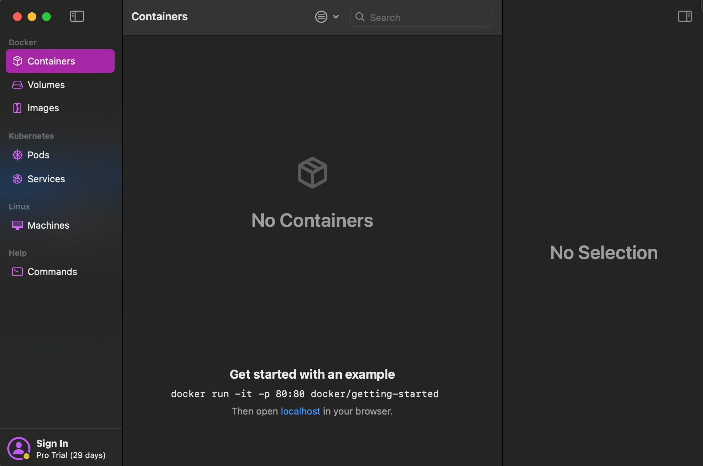
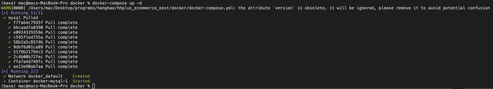

- 포트 지정: "3307:3306"
  - 3307은 컴퓨터에서 사용할 포트
  - 3306은 컨테이너 내부에서 사용할 포트
- 실행 준비: Docker Desktop 혹은 Orbstack 설치
  - orbstack
    - 설치: `brew install orbstack` -> 어플리케이션 생성됨
    - 어플리케이션 실행
    
- 실행 방법: docker 폴더 내에서 `docker-compose up -d` 실행

- 도커 컴포즈 실행 종료: `docker-compose down`