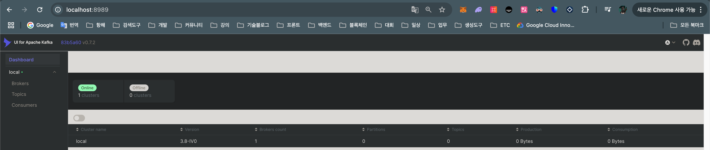

- 포트 지정: "3307:3306"
  - 3307은 컴퓨터에서 사용할 포트
  - 3306은 컨테이너 내부에서 사용할 포트
- 실행 준비: Docker Desktop 혹은 Orbstack 설치
  - orbstack
    - 설치: `brew install orbstack` -> 어플리케이션 생성됨
    - 어플리케이션 실행
    
- 실행 방법: docker 폴더 내에서 `docker-compose up -d` 실행

- 도커 컴포즈 실행 종료: `docker-compose down`

- 레디스 관련
  - medis 설치: `brew install medis`
  - `docker ps` 로 컨테이너 아이디 확인 8f87006f5cd6
  - `docker exec -it 8f87006f5cd6 /bin/sh` 실행
  - `redis-cli` 입력시 명령어 입력 가능
  - 명령어 입력: `setnx testname 1` -> 첫번째만 true, 나머지 false == 분산락 개념
  - 이후 medis 에서 조회해 보면 testname에 1이 들어가 있다.
  - setnx testname 1 한 후에 setnx testname 2 하려고 하면 이미 점유됨 == Simple Lock
    - while 문을 사용해서 여러번 돌려 락을 획득하는 방식 == Spin Lock
  - 만약 서버가 꺼져서 레디스 락 점유한 채로 지속됨 방지 -> TTL 옵션 설정()
    - `set seat2 1 nx ex 10`: 10초동안 seat2에 대하여 유저1이 요청하고 비어있을 때만 true리턴 -> 유저2가 시도해도 10초간 락 획득 못함
  - 위와 같은 세팅들을 레디스 컨피그에서 설정할 수 있다.

- 주키퍼 & 카프카 관련
  - UI로 확인: `docker-compose -f docker-compose-ui.yml up -d`
    - docker ps -> 0.0.0.0:8989 로 띄워진 것을 확인 -> localhost:8989 접근후 UI 확인
    
