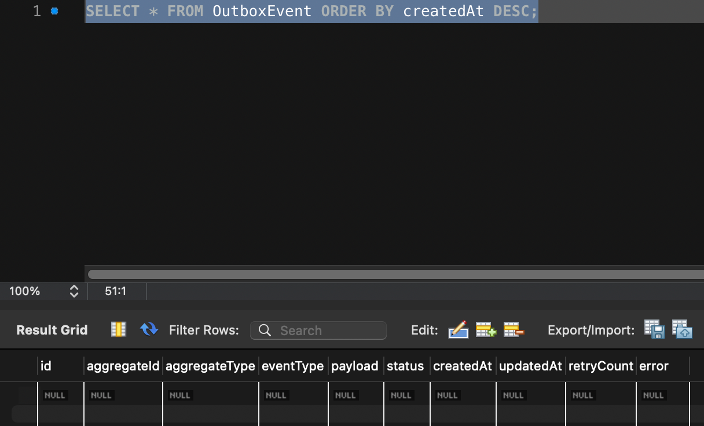
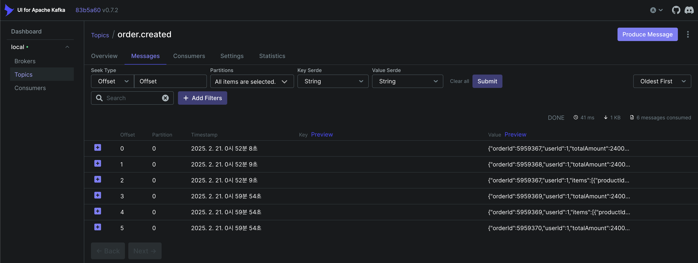
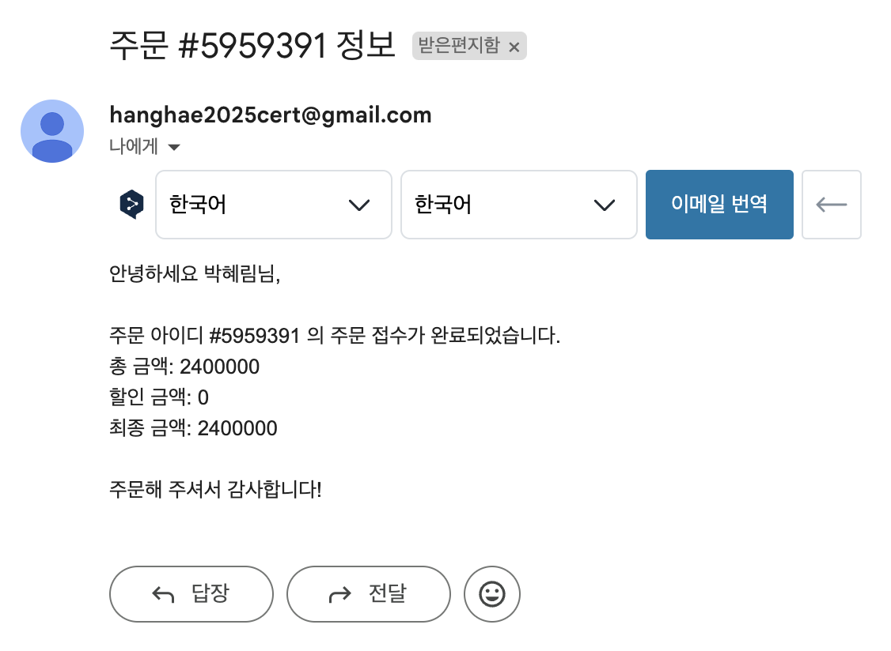

## 캐시를 활용한 성능 개선 방안에 대한 분석 (feat. redis)

### 캐싱 적용이 필요한 API 분석
- 선착순 쿠폰 목록 조회 기능: `GET /coupons/fcfs` <br/>
    쿠폰 목록은 변경 빈도가 낮으나 동시 다발적인 조회가 예상되어, 캐싱을 통해 DB 부하를 효과적으로 감소시킬 수 있다. 다만, 선착순 쿠폰의 개수가 계속 변동되기 때문에 Redis를 활용해 쿠폰의 실시간 수량 정보만 별도로 관리하고, 나머지 쿠폰 정보(쿠폰명, 할인율, 기간 등)는 캐싱하는 방식의 구현이 필요할 것 같다. 이를 통해 실시간성과 응답 성능 개선이 가능하다.
- 선착순 쿠폰 상세 조회 기능: `GET /coupons/fcfs/{id}` <br/>
    개별 쿠폰의 상세 정보는 변경이 적고 동시 조회 가능성이 높아 캐싱을 통한 응답 성능 개선이 가능하다.
- 인기 상품 조회 기능: `GET /products/popular` <br/>
    상품 조회시 복잡한 정렬 및 집계 연산이 필요하며, 같은 데이터에 대한 반복적인 요청이 많아 DB에 직접 접근하면 부하가 큰데 Redis를 이용하면 메모리에서 데이터를 가져와 응답 속도가 빨라지면서 데이터베이스 부하가 감소할 수 있다.
- 상품 상세 조회 기능: `GET /products/{id}` <br/>
    상품 상세 정보는 빈번한 조회가 예상되나 데이터 변경은 적어 캐싱을 통해 DB 부하를 크게 줄일 수 있다.

#### 캐싱 적용을 제외한 API
- 결제 관련 조회: `GET /payments`, `GET /payments/{id}` <br/>
    결제 정보는 실시간성이 매우 중요하며, 부정확한 정보 제공 시 심각한 문제가 발생할 수 있다.
- 잔액 조회: `GET /balance/{userId}` <br/>
    사용자 잔액 또한 실시간으로 정확한 정보가 필요하며, 캐싱을 하면 오차가 발생할 수 있다.
- 보유 쿠폰 조회: `GET /coupons/my` <br/>
    개인화된 쿠폰 정보는 잔액 조회와 마찬가지로 실시간 동기화가 필요하며, 조회 빈도 대비 캐싱 효과가 적다.


### 캐시의 정의 및 주요 캐싱 전략 4가지

#### 캐시의 정의
- 캐시는 데이터를 임시로 복사해두는 Storage 계층으로, 적은 부하로 API 응답을 빠르게 처리하기 위해 사용한다. 우리 주변에서는 CPU 캐시(자주 접근하는 데이터를 메모리에 저장), DNS 캐시(웹사이트 IP를 기록하여 DNS 조회 수 감소), CDN(이미지/영상 등 컨텐츠를 CDN 서버에 저장하여 애플리케이션 부하 감소) 등을 예로 들 수 있다.
- 캐시는 크게 애플리케이션의 메모리를 사용하는 'application level'과 Redis와 같은 외부 캐시 서비스를 사용하는 'external level'로 나눌 수 있으며, application level은 속도가 빠르고 비용이 적지만 애플리케이션이 종료되면 데이터가 삭제되고 분산 환경에서 데이터 불일치 문제가 발생할 수 있다. external level은 별도의 캐시 서비스를 통해 분산 환경에서도 일관된 데이터를 제공할 수 있고 장애 발생 시 복구가 용이하지만 네트워크 통신 비용이 발생한다는 특징이 있다.
    - application level (메모리 캐시): 애플리케이션의 메모리에 데이터를 저장해두고 같은 요청에 대해 데이터를 빠르게 접근해 반환함으로서 API 성능을 향상할 수 있다.
        - Nest.js 메모리 캐시 인터셉터 예시
            ```typescript
            @Injectable()
            export class HttpCacheInterceptor extends CacheInterceptor {
                trackBy(context: ExecutionContext): string | undefined {
                    const cacheKey = this.reflector.get(
                        CACHE_KEY_METADATA,
                        context.getHandler(),
                    );
                
                    if (cacheKey) {
                        const request = context.switchToHttp().getRequest();
                        return `${cacheKey}-${request._parsedUrl.query}`;
                    }
                
                    return super.trackBy(context);
                }
            }
            ```
        - 단일 서버 환경의 어플리케이션 캐시
        
        - 분산 환경에서의 어플리케이션 캐시
        

    - external Level (별도의 캐시 서비스): 별도의 캐시 Storage 혹은 이를 담당하는 API 서버를 통해 캐싱 환경을 제공한다.
    

#### 캐시 스탬피드(Cache Stampede) 현상
    캐시 스탬피드 현상은 캐시가 없을 때 다수의 요청이 동시에 DB 조회를 시도하여 과도한 부하가 발생하는 현상이다. 예를 들면 캐시 데이터 조회에 100ms가 소요되는 상황에서 100ms 이내에 10만 트래픽이 동시에 유입되는 경우 모든 요청이 캐시 미스로 인해 DB 조회를 시도하게 되는데 이는 DB 부하 급증으로 시스템 장애 가능성이 증가하게 된다.

    이를 방지하기 위해서는 기본적으로 락 메커니즘을 적용하여 첫 번째 요청만 DB를 조회한 후 캐시를 갱신하고 나머지 요청은 갱신된 캐시를 사용하도록 하고, 캐시가 만료될 시간이 되기 전에 데이터를 미리 갱신한다던가, 아니면 재시도 메커니즘을 도입해 캐시 미스 발생 시 즉시 DB를 조회하는 대신 짧은 대기 후 다시 캐시를 확인하도록 하면 캐시 스탬피드로 인한 과부하를 줄일 수 있다고 한다. (CTO님께서 알려주심)


### 주요 캐싱 전략 4가지
#### 1. Cache-Aside (Lazy Loading) (*)
캐시 어사이드는 캐시를 먼저 확인하고 없으면 DB에서 조회하여 캐시에 저장하는 캐싱 전략이다. 이 는 DB 부하를 줄이면서도 실시간성이 크게 중요하지 않은 데이터 조회에 적합해서 상품 카테고리 정보나 상품 상세 정보처럼 자주 변경되지 않는 데이터에 활용하면 좋다. 가장 일반적인 캐싱 전략이라고 볼 수 있다.
```typescript
const getProductDetails = async (productId) => {
    const cacheKey = `product:${productId}`;
    let product = await redis.get(cacheKey);

    if (!product) {
        product = await db.getProductById(productId);
        await redis.set(cacheKey, JSON.stringify(product), 'EX', 3600); // 1시간 캐싱
    } else {
        product = JSON.parse(product);
    }

    return product;
};
```
#### 2. Read-Through (*)
Read Through는 캐시 어사이드와 유사하지만 어플리케이션이 직접 캐시를 관리하는 것이 아니라 아래 코드와 같이 캐시 계층에서 데이터 로드를 자동으로 수행하는 방식이며 이 캐싱 전략은 어플리케이션 코드를 단순화할 수 있고 캐시 관리가 용이하여 현재 프로젝트에서는 인기 상품 목록이나 실시간 인기 상품 순위 조회처럼 주기적으로 갱신되는 데이터 활용한다.
```typescript
const getPopularProducts = async () => {
    return await cacheClient.readThrough('popular-products', async () => {
        return await db.getPopularProducts();
    }, 3600);
};
```
#### 3. Write-Through (*)
Write Through 캐싱 전략은 데이터를 먼저 캐시에 기록한 후 데이터를 동기적으로 DB에 저장하는 방식이다. 이 방식은 데이터 정합성이 중요한 경우에 적합하지만, 쓰기 작업이 많을 경우 지연 시간이 증가할 수 있다는 단점이 있으나 상품 결제시 상품 재고 수량을 가져오는 것처럼 정확성이 중요한 데이터에 주로 활용한다.
```typescript
const updateStock = async (productId, quantity) => {
    const cacheKey = `stock:${productId}`;
    await redis.set(cacheKey, quantity); // 캐시에 먼저 저장
    await db.updateStock(productId, quantity); // DB 동기화
};
```
#### 4. Write-Behind (Write-Back)
Write Behind는 말그대로 데이터를 캐시에 먼저 쓰고, 일정 시간 후에 배치로 DB에 기록하는 방식이다. 이 방식은 쓰기 성능을 높일 수 있지만 시스템 장애 시 데이터 유실 가능성이 있어 로그 데이터나 통계 데이터처럼 중요도가 약간의 손실이 허용되는 정도의 데이터를 캐싱할 때 활용한다.


### Redis 자료 구조 및 명령어

- 이미지 출처: https://programmingiraffe.tistory.com/170
- Redis는 key-value 형식의 데이터 구조를 지원하는 데이터베이스로, 위와 같이 key에 해당하는 value의 값으로 다양한 자료구조를 지원한다.

#### 자주 쓰이는 명령어

- **Strings**: Key-Value 형태로 저장되는 가장 기본적인 데이터 타입이다.
- Hashes: 필드-값 쌍을 저장하는 객체와 유사한 데이터 구조이다.
- Lists: 문자열을 양방향으로 삽입/삭제할 수 있는 Linked List 구조로 되어있다.
- **Sets**: 중복을 허용하지 않는 정렬되지 않은 문자열 집합이다.
- **Sorted Sets**: 정렬된 중복 없는 문자열 집합이다. Score(가중치)로 되어 있어 랭킹 시스템에 적합하다.
    - 참고 블로그: https://medium.com/analytics-vidhya/redis-sorted-sets-explained-2d8b6302525#:~:text=Sorted%20Set%20is%20similar%20to,smallest%20to%20the%20greatest%20score

