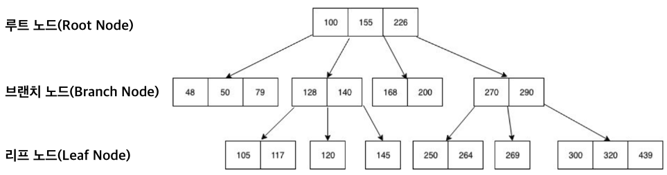
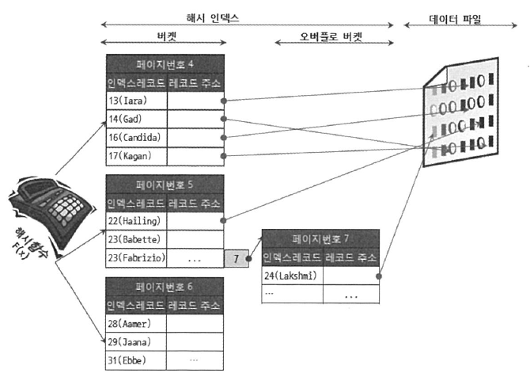
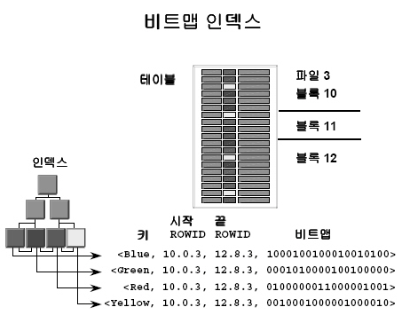
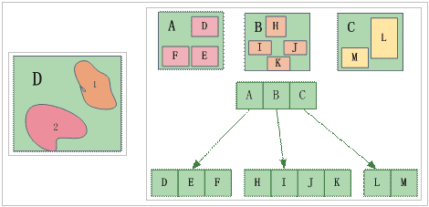
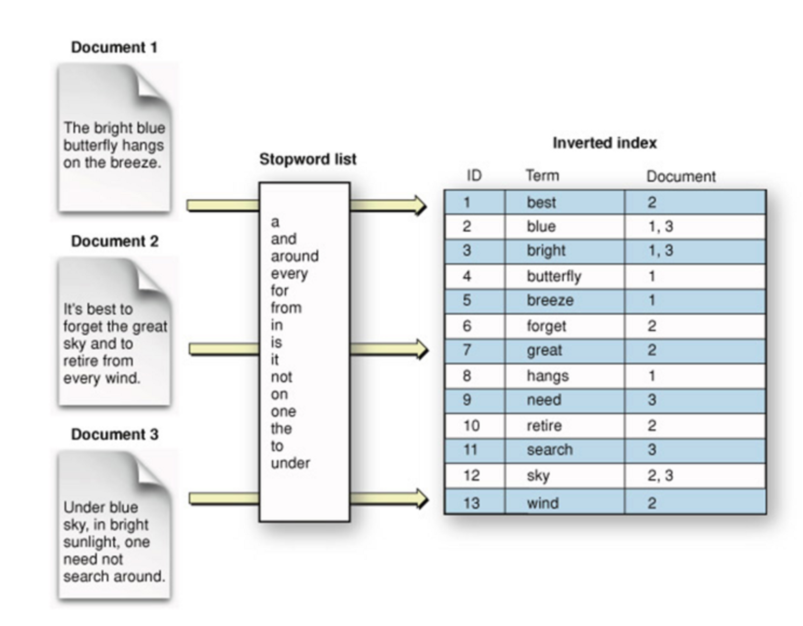
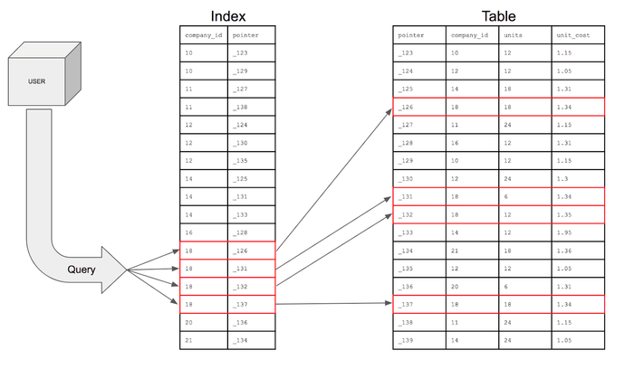
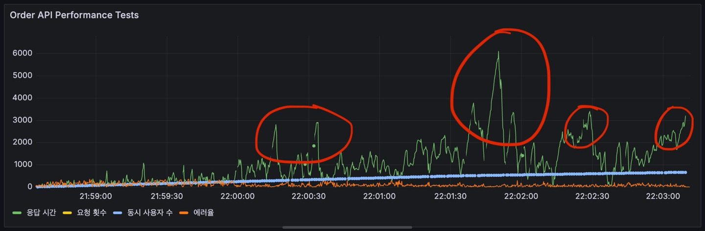

# 이커머스 시스템에서 인덱스를 통한 성능 최적화 방안

## 인덱스와 복합인덱스의 동작 원리
### 1. 인덱스(Index)의 기본 개념

#### 1.1 인덱스란?
인덱스는 데이터베이스 테이블의 검색 속도를 향상시키기 위한 자료구조이다. 책의 목차나 색인과 같이, 데이터의 위치를 빠르게 찾을 수 있도록 도와주는 포인터 역할을 한다.

#### 1.2 인덱스의 자료구조
대부분의 RDBMS는 B-Tree(Balanced Tree) 구조를 사용한다.

##### B-Tree (Balanced Tree)

- 균형 잡힌 트리 구조로, 모든 리프 노드가 같은 레벨에 있다
- 한 노드당 여러 개의 키를 가질 수 있다.
- 이진 탐색을 통해 시간복잡도 O(log n)으로 데이터 접근 가능하다.
- 범위 검색에 효율적이다.
---

##### Hash Index

- 해시 함수를 사용하여 키를 해시값으로 변환한다.
- 시간복잡도 O(1)로 매우 빠른 검색 속도를 가진다.
- 정확한 일치 검색에만 효율적이다.
- 범위 검색이나 정렬에는 부적합하다.
- Memory 스토리지 엔진에서 주로 사용한다.
---

##### Bitmap Index

- 각 컬럼의 고유값에 대해 비트맵을 생성한다.
- 카디널리티가 낮은 컬럼(성별, 상태값 등)에 효율적이다.
- 대량의 데이터에서 AND/OR 연산이 빠르다.
- 데이터 변경이 빈번한 경우 성능 저하가 일어난다.
- Oracle 등에서 사용한다.
---

##### R-Tree

- 공간 데이터를 인덱싱하는데 사용한다.
- 2차원 이상의 데이터를 효율적으로 처리할 수 있다.
- GIS(지리정보시스템) 데이터베이스에서 주로 사용한다.
- PostgreSQL의 GiST(Generalized Search Tree) 등에서 사용한다.
---

##### Full-Text Search Index

- 텍스트 문서의 내용을 인덱싱하는데 사용한다.
- 단어나 구문 검색에 최적화 되어있다.
- 역인덱스(Inverted Index) 구조를 사용한다.
- MySQL의 FULLTEXT 인덱스, Elasticsearch 등에서 사용한다.
---

#### 1.3 B-Tree 인덱스의 동작 방식 
1. **인덱스 생성 시**:
   - 지정된 칼럼의 데이터를 정렬
   - 정렬된 데이터에 대한 포인터 생성
   - B-Tree 구조로 저장

2. **데이터 검색 시**:
   - 인덱스 B-Tree를 통해 검색 조건에 맞는 데이터의 위치 확인
   - 확인된 위치의 실제 데이터 접근
   - 결과 반환

### 2. 복합인덱스의 이해

#### 2.1 복합인덱스란?
둘 이상의 칼럼을 조합하여 생성하는 인덱스를 의미한다. 여러 칼럼을 순서대로 정렬하여 하나의 인덱스로 만듭니다.


#### 2.2 복합인덱스의 특징
1. **칼럼 순서의 중요성**:
   - 첫 번째 칼럼을 기준으로 정렬
   - 같은 값에 대해 두 번째 칼럼 기준으로 정렬
   - 이후 칼럼들도 같은 방식으로 정렬

2. **선두 칼럼 규칙**:
   - WHERE 절에서 인덱스의 첫 번째 칼럼이 조건으로 사용되어야 함
   - 중간 칼럼만 단독으로 사용할 경우 인덱스가 정상적으로 동작하지 않음

### 3. 인덱스가 쿼리 성능을 높이는 원리

#### 3.1 테이블 전체 스캔 vs 인덱스 스캔
1. **테이블 전체 스캔**:
   - 모든 데이터 페이지를 순차적으로 읽음
   - 대량의 I/O 발생
   - 성능이 데이터 양에 비례하여 저하

2. **인덱스 스캔**:
   - B-Tree를 통한 빠른 데이터 위치 파악
   - 필요한 데이터 페이지만 접근
   - 데이터 양이 많아도 일정한 성능 유지

#### 3.2 성능 향상의 구체적 사례
```sql
-- 인덱스가 없는 경우 (테이블 전체 스캔, 성능: O(n))
SELECT o.*, oi.* 
FROM orders o 
JOIN order_items oi ON o.id = oi.order_id
WHERE o.user_id = 12345 
AND o.status = 'COMPLETED';

-- 인덱스 적용 후 (인덱스를 통한 검색, 성능: O(log n))
CREATE INDEX idx_orders_user_status ON orders(user_id, status);
SELECT o.*, oi.* 
FROM orders o 
JOIN order_items oi ON o.id = oi.order_id
WHERE o.user_id = 12345 
AND o.status = 'COMPLETED';
```

#### 3.3 복합인덱스의 성능 최적화
1. **칼럼 순서 최적화**:
   ```sql
   -- 복합인덱스: (user_id, status)
   
    -- 효율적인 쿼리 (인덱스 완전 활용)
    SELECT p.* 
    FROM payments p
    WHERE p.user_id = 12345 
    AND p.status = 'SUCCESS';

    -- 비효율적인 쿼리 (인덱스 부분 활용)
    SELECT p.* 
    FROM payments p
    WHERE p.status = 'SUCCESS';
   ```

2. **카디널리티 고려**:
   - 높은 카디널리티(중복이 적은) 칼럼을 앞쪽에 배치
   - 검색 조건을 최대한 좁힐 수 있는 순서로 구성
   ```sql
   -- 높은 카디널리티(user_id)를 앞에, 낮은 카디널리티(status)를 뒤에 배치
    CREATE INDEX idx_payments_user_status ON payments(user_id, status);
   ```

### 4. 주의사항 및 고려사항

#### 4.1 인덱스 사용 시 주의점
1. **과도한 인덱스 생성 지양**:
   - 저장 공간 증가
   - INSERT, UPDATE, DELETE 성능 저하
   - 인덱스 유지보수 비용 증가

2. **인덱스 칼럼 선정 기준**:
   - WHERE 절에서 자주 사용되는 칼럼
   - JOIN 조건으로 자주 사용되는 칼럼
   - ORDER BY, GROUP BY에서 사용되는 칼럼

#### 4.2 복합인덱스 설계 시 고려사항
1. **쿼리 패턴 분석**:
   - 자주 사용되는 WHERE 조건 조합 파악
   - 조건절의 선택도(Selectivity) 고려

2. **인덱스 재사용성**:
   - 다양한 쿼리에서 활용 가능한 구성
   - 불필요한 중복 인덱스 제거

### 5. 결론
인덱스와 복합인덱스는 데이터베이스의 검색 성능을 극대화하는 핵심 요소입니다. B-Tree 구조를 통해 효율적인 데이터 접근이 가능하며, 특히 복합인덱스의 경우 칼럼 순서와 카디널리티를 고려한 적절한 설계가 중요합니다. 하지만 과도한 인덱스 사용은 오히려 성능 저하를 초래할 수 있으므로, 실제 쿼리 패턴과 데이터 특성을 고려한 신중한 설계가 필요하다.


## 현재 API 목록의 검색조건 및 카디널리티 분석
### 쿠폰 관련 (테이블: `FcfsCoupon`)
##### **필드**
  - `id` (INT)
  - `couponId` (INT)
  - `totalQuantity` (INT)
  - `stockQuantity` (INT)
  - `startDate` (DATETIME)
  - `endDate` (DATETIME)
  - `createdAt` (DATETIME)
  
##### **조회조건 현황**
1. **GET /coupons/fcfs**
    - **조건**: `isUsed = false`, `expirationDate >= NOW()`
    - **카디널리티**:
        - `isUsed`: `true`와 `false`값만 존재하기 때문에 카디널리티가 낮음
        - `expirationDate`: 선착순 쿠폰의 종류가 다양해질 수록 expirationDate의 분포가 다양해지면서 카디널리티가 높아질 수 있으나 모든 쿠폰이 매월 말일 만료되는 형태라면 카디널리티가 낮아질 수 있음 
    - **인덱스 필요성**: (X) `expirationDate`의 경우 카디널리티가 높은 상황이라고 해도 오름차순 정렬을 적용하면 인덱스를 사용하지 않고도 성능을 최적화할 수 있으므로, 별도의 인덱스를 적용할 필요가 없음
2. **POST /coupons/fcfs**
    - **조건**: `couponId`로 신규 쿠폰 발급
    - **카디널리티**:
        - `couponId`: 고유값이므로 별도의 인덱스가 필요하지 않음
    - **인덱스 필요성**: (X) Primary Key를 사용하므로 추가 인덱스가 불필요
3. **GET /coupons/fcfs/{couponId}**
    - **조건**: `couponId = ?`
    - **카디널리티**:
        - `couponId`: 고유값이므로 별도의 인덱스가 필요하지 않음
    - **인덱스 필요성**: (X) Primary Key를 사용하므로 추가 인덱스가 불필요
---

### 주문 관련 (테이블: `Order`)
##### **필드**
  - `id` (INT)
  - `userId` (INT)
  - `couponId` (INT)
  - `totalAmount` (DECIMAL)
  - `discountAmount` (DECIMAL)
  - `finalAmount` (DECIMAL)
  - `status` (ENUM)
  - `orderedAt` (DATETIME)
  - `paidAt` (DATETIME)

##### **조회조건 현황**
1. **GET /orders**
   - **조건**: `userId = ?`, `status = ?`
   - **카디널리티**:
     - `userId`: 사용자마다 서로 다른 값을 가지고 있어 카디널리티가 높음
     - `status`: 상태 값의 종류가 많지 않으므로 카디널리티가 낮음
   - **인덱스 필요성**: (O) 주문 정보 조회 시 사용자 기반으로 데이터를 조회하는 일이 잦고, `userId`에 대한 카디널리티가 높으므로 인덱스를 적용해야 한다. 
   - **적용 방안**: 위 검색 조건으로 인덱스 적용시 `userId -> status` 순서로 개별 사용자를 기준으로 우선 필터링하여 검색 범위를 크게 줄인 후 그 중에서 status를 추가로 필터링하여 성능을 최적화한다.

2. **POST /orders**
   - **조건**: `orderId`로 신규 주문 생성
    - **카디널리티**:
        - `orderId`: 고유값이므로 별도의 인덱스가 필요하지 않음
    - **인덱스 필요성**: (X) Primary Key를 사용하므로 추가 인덱스가 불필요

3. **GET /orders/{orderId}**
   - **조건**: `orderId = ?`
    - **카디널리티**:
        - `orderId`: 고유값이므로 별도의 인덱스가 필요하지 않음
    - **인덱스 필요성**: (X) Primary Key를 사용하므로 추가 인덱스가 불필요

---

### 결제 관련 (테이블: `Payment`)
##### **필드**
  - `id` (INT)
  - `orderId` (INT)
  - `userId` (INT)
  - `paymentMethod` (VARCHAR)
  - `amount` (DECIMAL)
  - `status` (ENUM)
  - `pgTransactionId` (VARCHAR)

##### **조회조건 현황**
1. **GET /payments**
   - **조건**: `userId = ?`, `status = ?`
   - **카디널리티**:
     - `userId`: 사용자마다 고유한 값을 가지므로 카디널리티가 높음
     - `status`: 결제 상태는 제한된 상태값만 가지므로 카디널리티가 낮음
   - **인덱스 필요성**: (O) 결제 정보 조회 시 사용자 기반으로 데이터를 조회하는 일이 잦고, `userId`에 대한 카디널리티가 높으므로 인덱스를 적용해야 한다. 
   - **적용 방안**: 사용자별 결제 내역 조회가 빈번하므로 userId를 선행 컬럼으로 하여 `userId -> status` 순서로 복합 인덱스를 구성한다.

2. **POST /payments**
   - **조건**: `paymentId`로 신규 결제 생성
    - **카디널리티**:
        - `paymentId`: 고유값이므로 별도의 인덱스가 필요하지 않음
    - **인덱스 필요성**: (X) Primary Key를 사용하므로 추가 인덱스가 불필요

3. **GET /payments/{paymentId}**
   - **조건**: `paymentId = ?`
    - **카디널리티**:
        - `paymentId`: 고유값이므로 별도의 인덱스가 필요하지 않음
    - **인덱스 필요성**: (X) Primary Key를 사용하므로 추가 인덱스가 불필요

---

### 사용자 관련 (테이블: `UserAccount`)
##### **필드**
  - `userId` (INT)
  - `userName` (VARCHAR)
  - `email` (VARCHAR)
  - `isActive` (BOOLEAN)
  - `registrationDate` (DATETIME)

2. **GET /users/{userId}**
   - **조건**: `userId = ?`
    - **카디널리티**:
        - `userId`: 고유값이므로 별도의 인덱스가 필요하지 않음
    - **인덱스 필요성**: (X) Primary Key를 사용하므로 추가 인덱스가 불필요

---

### 상품 관련 (테이블: `Product`)
##### **필드**
  - `productId` (INT)
  - `name` (VARCHAR)
  - `category` (VARCHAR)
  - `price` (DECIMAL)
  - `stock` (INT)
  - `createdAt` (DATETIME)

##### **조회조건 현황**
1. **GET /products**
   - **조건**: `category = ?`, `stock > 0`
   - **카디널리티**:
     - `category`: 상품 카테고리 수가 제한적이므로 카디널리티는 중간 정도이다
     - `stock`: 재고량은 다양한 값을 가질 수 있으나, 보통 0보다 큰지 여부만 확인하므로 실질적 카디널리티는 낮은 편이다
   - **인덱스 필요성**: (0) 필요성은 중간 정도로, 만약 적용한다면 `category -> stock` 순서로 인덱스를 구성한다.

2. **GET /products/{productId}**
   - **조건**: `productId = ?`
    - **카디널리티**:
        - `productId`: 고유값이므로 별도의 인덱스가 필요하지 않음
    - **인덱스 필요성**: (X) Primary Key를 사용하므로 추가 인덱스가 불필요

---

### 결론
API 목록의 검색조건과 카디널리티를 분석한 결과, 주요 인덱스 적용이 필요한 테이블과 필드를 식별했습니다. 쿠폰(FcfsCoupon), 주문(Order), 결제(Payment), 사용자(UserAccount), 상품(Product) 테이블을 분석했는데, 주로 사용자 관련 조회가 빈번하고 카디널리티가 높은 필드들에 대해 인덱스 적용이 필요하다는 결론을 도출했고, 특히 Order 테이블과 Payment 테이블에서는 userId를 기준으로 한 조회가 빈번하고 카디널리티가 높아 인덱스 적용이 필요하다고 판단했다.
- Order 테이블: (userId, status) 인덱스 적용
- Payment 테이블: (userId, status) 인덱스 적용
- Product 테이블: (category, stock) 인덱스 적용 - 우선순위 낮음

반면, FcfsCoupon과 UserAccount 테이블 등은 기본키(Primary Key)만으로도 충분한 성능을 보장할 수 있어 추가 인덱스가 불필요한 것으로 판단했다. 위와 같은 인덱스 전략을 통해 사용자 기반의 조회 성능을 최적화하고, 전체적인 시스템 성능을 향상시킬 수 있을 것으로 기대된다.

## 인덱스 적용 전후 성능 테스트
#### 조회 데이터베이스 현황
| 테이블 | 레코드 수 |
|---------|------------|
| Order | 20,223,134 |
| OrderItem | 20,140,000 |
| UserAccount | 1,000,003 |
| ProductVariant | 90,362 |
| Product | 36,103 |
---

### 인덱스 적용 전

#### 테스트 환경 및 설정
| 항목 | 내용 |
|------|------|
| 총 테스트 시간 | 15분 (3분+5분+5분+2분) |
| 최대 동시 사용자 | 1,000명 |
| 테스트 대상 API | GET /order/{orderId} |
| 데이터베이스 규모 | 총 41,489,602 레코드 | 
---

### 부하 테스트 시나리오
| 단계 | 시간 | 목표 사용자 수 |
|------|------|----------------|
| 1단계 | 3분 | 0 → 500명 |
| 2단계 | 5분 | 500 → 1000명 |
| 3단계 | 5분 | 1000명 유지 |
| 4단계 | 2분 | 1000 → 0명 |
---

### 모니터링 지표
| 지표 | 설명 |
|------|------|
| 응답 시간 | http_req_duration의 평균값 |
| 요청 횟수 | http_reqs의 카운트 |
| 동시 사용자 수 | vus의 최대값 |
| 에러율 | http_req_failed의 카운트 |

### 인덱스 적용 전


#### 모니터링 지표별 결과
| 지표 | 값 | 설명 |
|--------|-------|-------------|
| **Average Response Time** | 1,075ms | 응답 시간 (평균) |
| **Maximum Response Time** | 6,107ms | 요청 중 가장 긴 응답 시간 |
| **Minimum Response Time** | 3.71ms | 요청 중 가장 짧은 응답 시간 |
| **Request Count** | 128,428회 | 처리된 요청 수 |
| **Maximum Concurrent Users** | 659명 | 최대 동시 접속 사용자 수 |
| **Average Concurrent Users** | 366명 | 평균 동시 접속 사용자 수 |
| **Response Time Std. Dev.** | 975.39ms | 응답 시간 표준 편차 |
| **95th Percentile Response Time** | 2,834ms | 95%의 응답 시간 |
| **99th Percentile Response Time** | 4,666ms | 상위 1% 응답 시간 |
---

#### 모니터링 지표별 분석
- Average Response Time (1,075ms): 전체 요청의 평균 처리 시간으로, 일반적인 웹 서비스 기준(500ms)의 2배 이상
- Maximum Response Time (6,107ms): 가장 느린 응답 시간으로, 평균의 6배 수준이며 심각한 성능 저하 구간 존재
- Minimum Response Time (3.71ms): 가장 빠른 응답 시간으로, 시스템의 최적 성능 수준
- Response Time Std. Dev. (975.39ms): 응답 시간의 변동폭이 매우 크다는 것을 보여주는 지표
- 95th/99th Percentile (2,834ms/4,666ms): 상위 5%와 1%의 느린 응답들이 전체 평균을 크게 상회
- Concurrent Users (최대 659명, 평균 366명): 동시 사용자 증가에 따른 성능 저하 패턴 확인 가능

#### 결론
- 성능 테스트 결과에 따르면, 평균 응답시간(1,075ms)과 최대 응답시간(6,107ms)의 큰 차이, 높은 표준편차(975.39ms), 그리고 95/99 백분위수(2,834ms/4,666ms) 응답시간의 급격한 증가 패턴이 관찰되는데, 이는 데이터베이스에서 자주 조회되는 컬럼에 대한 인덱스가 없어 발생하는 전체 테이블 스캔(Full Table Scan) 현상으로 인한 것으로 판단되며, 특히 동시 접속자 수가 증가할 때(최대 659명, 평균 366명) 최대 응답 시간이 약 6초 이상 크게 악화되는 것으로 보아 인덱스 설계와 적용을 통해 데이터 검색 성능을 최적화할 필요가 있는 것으로 확인 되었습니다.

### 인덱스 적용


