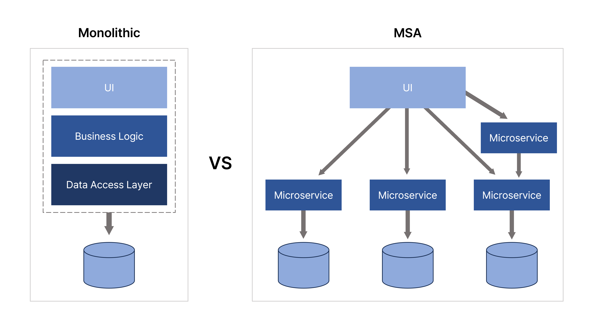

# MSA 환경에서의 트랜잭션 처리 한계점 및 해결 방안

## 마이크로서비스 아키텍처(MSA)란?
마이크로서비스 아키텍처(MSA)는 하나의 큰 애플리케이션을 여러 개의 독립적인 서비스로 분리하여 운영하는 아키텍처 패턴이다. 각 서비스는 독립적으로 배포되고, 확장되며, 자체 데이터베이스를 가질 수 있다.


### MSA의 이점
- 각 서비스별로 독립적인 배포가 가능하여 빠른 개발과 릴리즈가 가능하다.
- 각 서비스마다 최적의 기술 스택을 선택할 수 있다.
- 필요한 서비스만 선택적으로 확장 가능하다.
- 한 서비스의 장애가 전체 시스템에 영향을 주지 않는다.
- 각 서비스별로 독립적인 팀을 운영할 수 있다.

### MSA의 한계점
#### MSA의 트랜잭션 처리 문제
```
[예시] 주문 시스템 ([포인트 서비스] → [결제 서비스] → [주문 서비스])
```
1. 포인트 차감 성공
2. 결제 정보 추가 성공
3. 주문 정보 저장 실패

만약 MSA 환경에서 위와 같은 상황이 발생한다면 이전 단계의 트랜잭션을 롤백해야 하지만, 서비스가 분리되어 있어 일반적인 데이터베이스 트랜잭션으로는 처리가 불가능하다.

---

## MSA 환경에서의 트랜잭션 처리 한계

### 분산 환경의 제약사항
- 서로 다른 서비스의 데이터베이스 간 트랜잭션 처리가 불가능하다.
- 이기종 데이터베이스 간 트랜잭션이 지원되지 않는다.
- 대규모 데이터 처리 시 Oracle과 같은 DBMS에서도 타 DB와의 트랜잭션을 지원하지 않는다.

## Saga 패턴을 통한 해결 방안

### Saga 패턴의 구현 방식

#### 1. Choreography(코레오그래피) 방식
각 서비스가 자신의 로컬 트랜잭션을 관리하고 다음 단계를 직접 호출하는 방식이다.

```typescript
@Injectable()
export class PaymentService {
    constructor(
        private readonly pointService: PointService,
        private readonly orderService: OrderService,
        private readonly eventEmitter: EventEmitter2
    ) {}

    @OnEvent('payment.initiated')
    async processPayment(request: OrderRequest) {
        try {
            // 포인트 차감
            const pointResult = await this.pointService.deductPoints(request);
            if (!pointResult) {
                throw new PaymentException('포인트 차감 실패');
            }

            // 결제 정보 저장
            const paymentResult = await this.savePaymentInfo(request);
            if (!paymentResult) {
                // 실패 시 포인트 복구
                await this.pointService.restorePoints(request);
                throw new PaymentException('결제 정보 저장 실패');
            }

            // 주문 정보 업데이트 이벤트 발행
            this.eventEmitter.emit('payment.completed', {
                orderId: request.orderId,
                paymentId: paymentResult.id
            });

        } catch (error) {
            // 보상 트랜잭션 처리
            await this.handleCompensation(request);
            throw error;
        }
    }
}
```

#### 2. Orchestration(오케스트레이션) 방식
중앙의 오케스트레이터가 전체 트랜잭션을 조율하는 방식으로, 실무에서 가장 선호되는 방식이다.
```typescript
@Injectable()
export class OrderOrchestrator {
    constructor(
        private readonly paymentService: PaymentService,
        private readonly orderService: OrderService,
        private readonly eventEmitter: EventEmitter2
    ) {}
    
    @OnEventSafe('point.deducted')  // 안전한 이벤트 핸들링을 위해 @OnEventSafe를 사용한다.
    async handlePointDeducted(event: PointDeductedEvent) {
        try {
            // 포인트 차감 완료 후 결제 처리 시작
            await this.paymentService.processPayment(this.createPaymentRequest(event));
            this.eventEmitter.emit('payment.initiated', { orderId: event.orderId });
        } catch (error) {
            this.logger.error('Payment processing failed', error);
            // 보상 트랜잭션 실행
            await this.compensatePointDeduction(event);
        }
    }
    
    @OnEventSafe('payment.completed')
    async handlePaymentCompleted(event: PaymentCompletedEvent) {
        try {
            await this.orderService.completeOrder(this.createOrderRequest(event));
            this.eventEmitter.emit('order.completed', { orderId: event.orderId });
        } catch (error) {
            this.logger.error('Order completion failed', error);
            await this.compensatePayment(event);
        }
    }
}
```
##### 오케스트레이션 방식의 장점
- 트랜잭션의 흐름을 중앙에서 제어하므로 모니터링과 유지보수가 쉽다.
- 프로세스 변경 시 오케스트레이터만 수정하면 되어 변경이 용이하다.
- 다른 서비스에서도 동일한 오케스트레이터를 활용할 수 있다.
- 트랜잭션 조율의 책임이 오케스트레이터에 집중되어 있어 로직 파악이 쉽다.

## 실시간 이벤트 처리 구현

### 이벤트 발행 (Publisher)
```typescript
@Injectable()
export class OrderService {
    constructor(private readonly eventBus: EventBus) {}

    async createOrder(orderData: CreateOrderDto) {
        // 기존 주문 로직 수행
        const order = await this.orderRepository.save(orderData);
        
        // 트랜잭션 커밋 후 이벤트 발행
        this.eventBus.publish(new OrderCreatedEvent(order));
        
        return order;
    }
}
```

### 이벤트 구독 (Subscriber)
```typescript
@Injectable()
export class OrderCreatedHandler implements IEventHandler<OrderCreatedEvent> {
    constructor(
        private readonly repository: OrderRepository,
        private readonly logger: Logger
    ) {}

    @EventsHandler(OrderCreatedEvent)
    async handle(event: OrderCreatedEvent) {
        try {
            // 비즈니스 로직 처리
            await this.repository.processOrder(event);
        } catch (error) {
            // 에러 발생 시 로깅 (주문 프로세스에는 영향 없음)
            this.logger.error('주문 이벤트 처리 실패', error);
        }
    }
}
```

### 백프레셔 처리
RxJS를 활용한 데이터 흐름 제어

```typescript
@Injectable()
export class OrderStreamService {
    private orderSubject = new Subject<OrderEvent>();

    constructor() {
        this.orderSubject.pipe(
            bufferTime(100),
            filter(events => events.length > 0),
            map(events => events.slice(0, 100)), // 최대 100개씩
            concatMap(events => this.processOrderEvents(events))
        ).subscribe({
            error: (error) => this.handleError(error)
        });
    }

    async publishOrderEvent(event: OrderEvent) {
        this.orderSubject.next(event);
    }

    private async processOrderEvents(events: OrderEvent[]) {
        // 이벤트 일괄 처리
    }
}
```