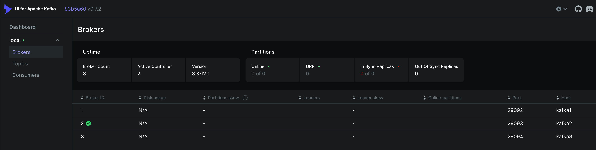
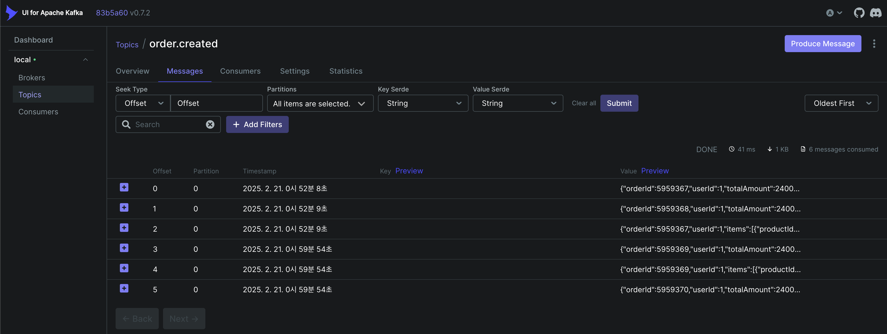
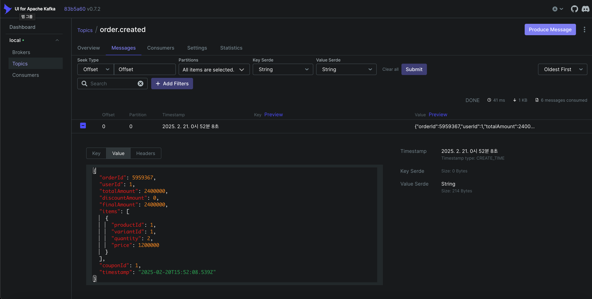
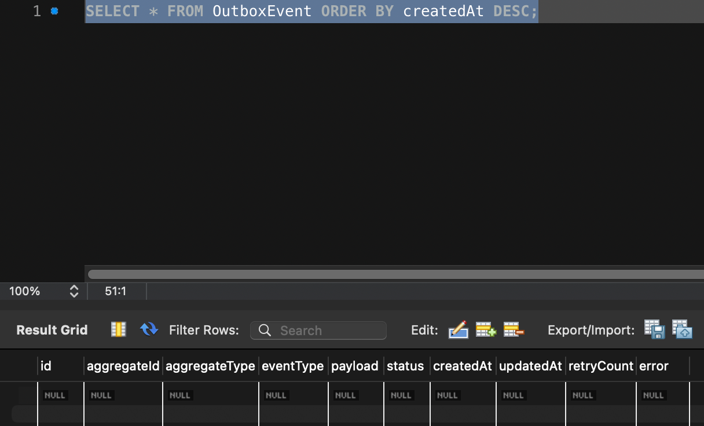

## Kafka 클러스터 구성하기 (with Docker)
### Docker Compose 파일 구성
- 메인 docker-compose.yml
```yaml
version: '3.8'
services:
    zookeeper:
        image: confluentinc/cp-zookeeper:latest
        ports:
            - "2181:2181"
        environment:
        ZOOKEEPER_CLIENT_PORT: 2181
        ZOOKEEPER_TICK_TIME: 3000
        ZOOKEEPER_INIT_LIMIT: 5
        ZOOKEEPER_SYNC_LIMIT: 2
        ZOOKEEPER_SERVER_ID: 1
        
    kafka1:
        image: confluentinc/cp-kafka:latest
        ports:
            - "9092:9092"
        depends_on:
            - zookeeper
        environment:
        KAFKA_BROKER_ID: 1
        KAFKA_ZOOKEEPER_CONNECT: zookeeper:2181
        KAFKA_LISTENER_SECURITY_PROTOCOL_MAP: INTERNAL:PLAINTEXT,EXTERNAL:PLAINTEXT
        KAFKA_INTER_BROKER_LISTENER_NAME: INTERNAL
        KAFKA_ADVERTISED_LISTENERS: INTERNAL://kafka1:29092,EXTERNAL://localhost:9092
        KAFKA_NUM_PARTITIONS: 3
        KAFKA_DEFAULT_REPLICATION_FACTOR: 3

    kafka2:
        image: confluentinc/cp-kafka:latest
        ports:
            - "9093:9093"
        depends_on:
            - zookeeper
        environment:
        KAFKA_BROKER_ID: 2
        KAFKA_ZOOKEEPER_CONNECT: zookeeper:2181
        KAFKA_LISTENER_SECURITY_PROTOCOL_MAP: INTERNAL:PLAINTEXT, EXTERNAL:PLAINTEXT
        KAFKA_INTER_BROKER_LISTENER_NAME: INTERNAL
        KAFKA_ADVERTISED_LISTENERS: INTERNAL://kafka2:29093,EXTERNAL://localhost:9093
        KAFKA_NUM_PARTITIONS: 3
        KAFKA_DEFAULT_REPLICATION_FACTOR: 3

    kafka3:
        image: confluentinc/cp-kafka:latest
        ports:
            - "9094:9094"
        depends_on:
            - zookeeper
        environment:
            KAFKA_BROKER_ID: 3
            KAFKA_ZOOKEEPER_CONNECT: zookeeper:2181
            KAFKA_LISTENER_SECURITY_PROTOCOL_MAP: INTERNAL:PLAINTEXT,EXTERNAL:PLAINTEXT
            KAFKA_INTER_BROKER_LISTENER_NAME: INTERNAL
            KAFKA_ADVERTISED_LISTENERS: INTERNAL://kafka3:29094,EXTERNAL://localhost:9094
            KAFKA_NUM_PARTITIONS: 3
            KAFKA_DEFAULT_REPLICATION_FACTOR: 3
```
- 카프카 UI docker-compose-ui.yml
```yaml
version: "2"
services:
  kafka-ui:
    image: provectuslabs/kafka-ui
    container_name: kafka-ui
    ports:
      - "8989:8080"
    restart: always
    environment:
      - KAFKA_CLUSTERS_0_NAME=local
      - KAFKA_CLUSTERS_0_BOOTSTRAPSERVERS=kafka1:29092,kafka2:29093,kafka3:29094
      - KAFKA_CLUSTERS_0_ZOOKEEPER=zookeeper:2181
```

### 컨테이너 실행 (docker/)
```
# 메인 서비스들 실행
docker-compose up -d

# Kafka UI 실행
docker-compose -f docker-compose-ui.yml up -d
```

### 실행 확인
```
# 카프카 관련 컨테이너 확인
docker ps | grep kafka

# 주키퍼 로그 확인
docker logs docker-zookeeper-1
```

### Kafka UI 접속
- 컨테이너 실행 후 http://localhost:8989 접속 

- 브로커 3개 표시 확인
  - kafka1: 9092
  - kafka2: 9093
  - kafka3: 9094

## 적용 확인
- kafka ui


- log
```
[Winston] 84487  - 02/21/2025, 12:59:54 AM  LOG [REQUEST] POST /order/1 params={"userId":"1"} body={"items":[{"productId":1,"variantId":1,"quantity":2}],"couponId":1}
[Winston] 84487  - 02/21/2025, 12:59:54 AM  LOG [SUCCESS] POST /order/1 201 108ms
```

## 트랜잭셔널 아웃박스 패턴 적용
- 카프카 전송 성공
  - log
  ```
    [Winston] 88108  - 02/21/2025, 1:57:46 AM  LOG [REQUEST] POST /order/1 params={"userId":"1"} body={"items":[{"productId":1,"variantId":1,"quantity":2}],"couponId":1}
    [Winston] 88108  - 02/21/2025, 1:57:47 AM  LOG [SUCCESS] POST /order/1 201 174ms
    [Winston] 88108  - 02/21/2025, 1:57:50 AM  LOG Starting scheduled outbox processing...
    [Winston] 88108  - 02/21/2025, 1:57:50 AM  LOG Starting to process outbox events...
    [Winston] 88108  - 02/21/2025, 1:57:50 AM  LOG Found 0 pending events
  ```
  - database
  

- 카프카 전송 실패
  - 카프카 브로커 종료: `docker stop 75377e6a3613 2178c8492062 4a717b191d1f`
  - 연결 끊어짐 -> 계속 진행
    - log
    ```
    [Winston] 88108  - 02/21/2025, 2:07:14 AM  LOG ERROR [Connection] Connection error: connect ECONNREFUSED ::1:9093 {"timestamp":"2025-02-20T17:07:14.187Z","logger":"kafkajs","broker":"localhost:9093","clientId":"ecommerce-app-client","stack":"Error: connect ECONNREFUSED ::1:9093\n    at __node_internal_captureLargerStackTrace (node:internal/errors:496:5)\n    at __node_internal_exceptionWithHostPort (node:internal/errors:671:12)\n    at TCPConnectWrap.afterConnect [as oncomplete] (node:net:1555:16)"}
    ```
  - 주문 요청